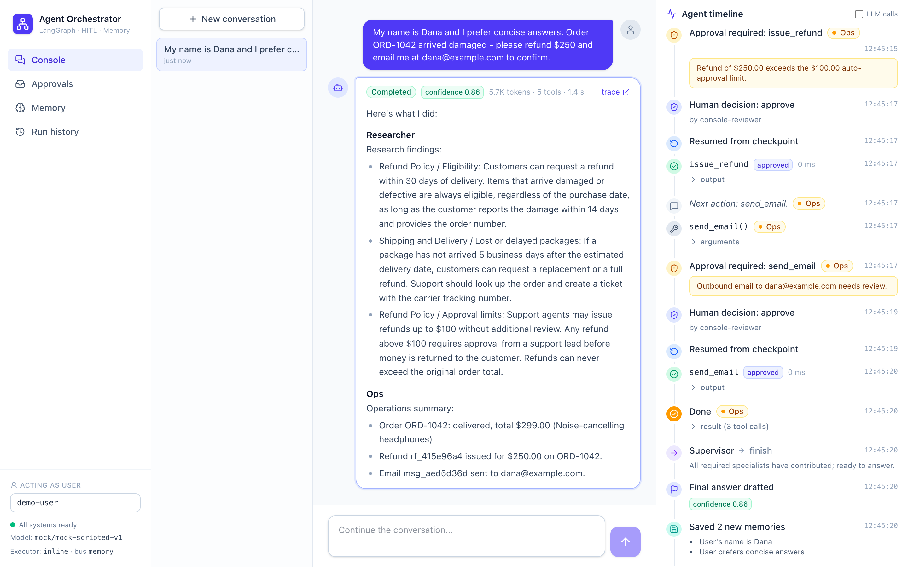
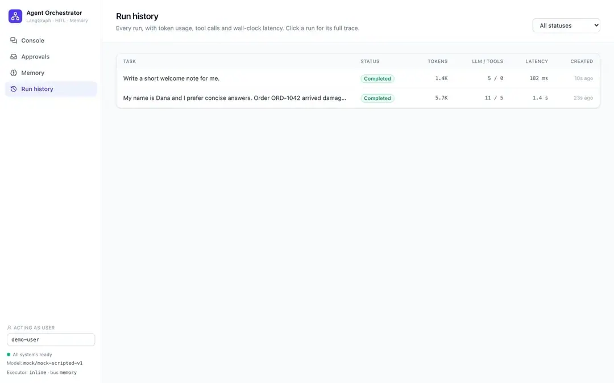
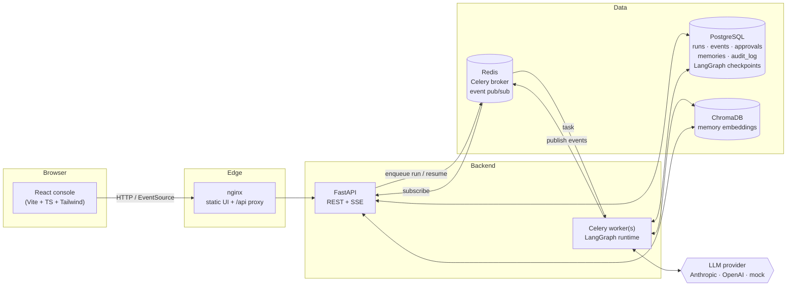
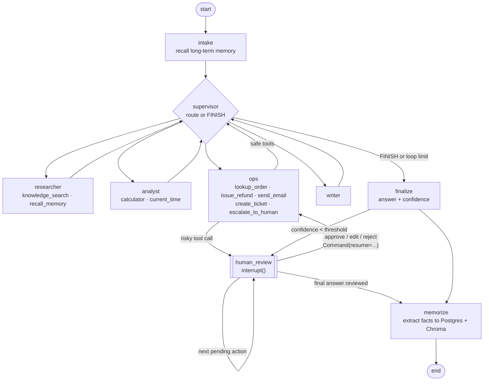
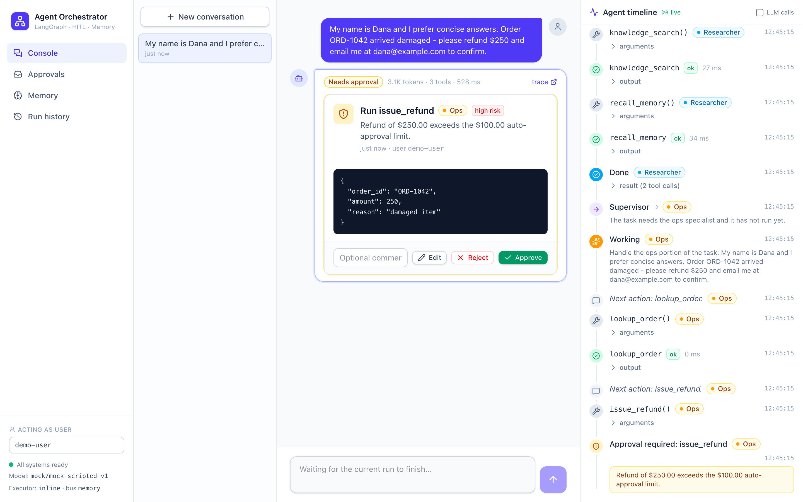
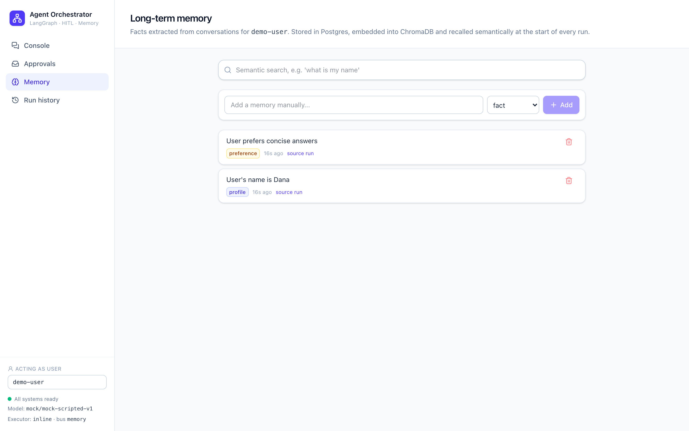
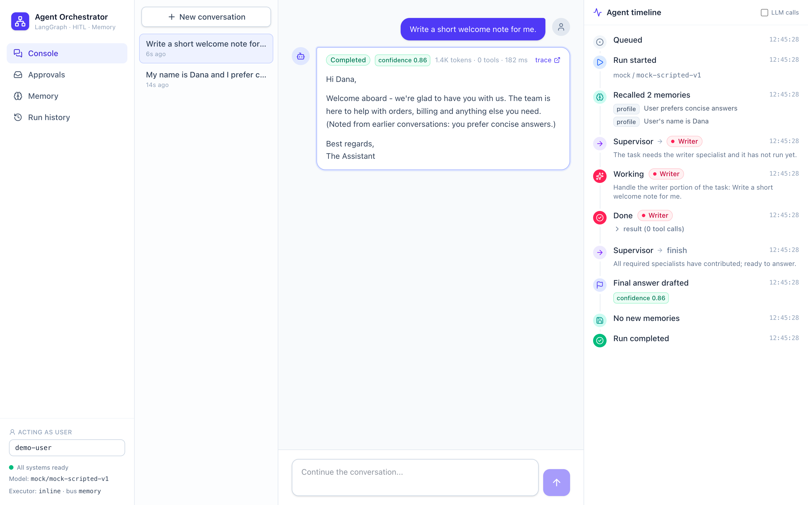
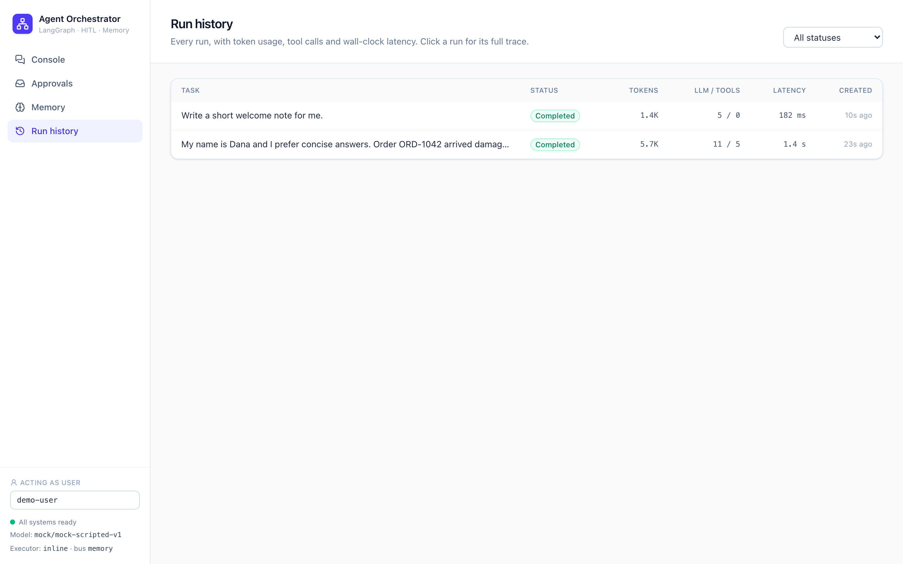

# Agent Orchestrator

**A production-shaped multi-agent system: a LangGraph supervisor delegates to specialist agents that use typed tools, remember users across conversations, and pause for a human whenever an action is risky.**

[](https://github.com/aqkprogrammer/agent-orchestrator/actions/workflows/ci.yml)


Most agent demos stop at "the LLM called a function". This project shows the parts that make agents shippable: **durable execution** (every step is checkpointed in Postgres, so a run can pause for hours and resume in a different process), **human-in-the-loop approvals** driven by an explicit risk policy, **long-term memory** with semantic recall, **an audit trail** of every tool call, and **live observability** of each agent step streamed to a React console.

It runs fully offline out of the box. A deterministic mock LLM and a hashing embedder exercise every feature without API keys. Set one environment variable to switch to Claude (`claude-sonnet-5`) or OpenAI.





---

## Features

| | |
|---|---|
| **Supervisor delegation** | A supervisor LLM routes work to a *Researcher*, *Analyst*, *Ops/Support* agent and *Writer*, one at a time, with loop limits (max delegations, max visits per agent, max tool rounds). A *Finalizer* step then combines their results. |
| **Typed tool use** | 10 tools with pydantic argument schemas (exported as JSON Schema to the model): knowledge-base search (BM25), a safe AST-based calculator (no `eval`), current time, memory save/recall, order lookup, tickets, refunds, outbound email, escalation. Invalid arguments are returned to the model as recoverable errors. |
| **Human-in-the-loop** | A `RiskPolicy` decides what needs a human: refunds above a threshold, all outbound email, explicit escalations, and low-confidence final answers. The graph calls LangGraph `interrupt()`, the run becomes `awaiting_approval`, and a reviewer can **approve, reject or edit** the action (edited arguments are re-validated). The run resumes from its checkpoint with `Command(resume=...)`. Several approvals in one run are chained. |
| **Persistent memory** | *Short-term*: thread state (conversation turns) in the LangGraph checkpointer (Postgres). *Long-term*: facts extracted after each run are stored in Postgres (the source of truth, deduplicated per user) and embedded into ChromaDB. At the start of each run, relevant memories are recalled by semantic search, together with the user's profile and preference facts. Each user has their own memory namespace. You can browse, search, add and delete memories. |
| **Async execution** | The API only enqueues. Celery workers (Redis broker) execute graphs and publish events over Redis pub/sub. A no-infra mode runs graphs in an in-process thread pool instead. |
| **Real-time streaming** | Server-Sent Events replay the stored history and then stream live events, with resume via `Last-Event-ID`. Events cover routing decisions, agent start/finish, every LLM call (tokens and latency), tool calls and results, approvals, and memory reads and writes. |
| **Audit & tracing** | Every tool execution, rejection and error is written to an `audit_log` table with arguments, result, status, agent and latency. The run history shows token and latency totals per run and per agent. |
| **React console** | A chat-style task view with a live agent timeline, an approvals inbox, a memory browser, run history and a per-run trace view. |
| **Operational basics** | Liveness and readiness probes, structured JSON logging (structlog), `pydantic-settings` configuration, multi-stage non-root Docker images with healthchecks, and CI. |

---

## Architecture



### Agent graph



The live topology is also exposed at `GET /api/graph` (Mermaid source generated by LangGraph).

### Lifecycle of a run

1. `POST /api/runs` creates a thread (or continues one), stores the run as `queued`, emits `run_queued` and dispatches it to Celery (or to the inline pool).
2. A worker atomically claims the run (`queued → running`) and streams the graph with thread-scoped checkpointing.
3. Nodes emit events. Each event is written to Postgres **before** it is published to Redis, so SSE clients subscribe first, replay from the database, and then follow the live stream without gaps.
4. When a node calls `interrupt()`, the worker records an approval (kind, tool, arguments, reason, risk) and marks the run `awaiting_approval`. The worker is then free for other work.
5. `POST /api/approvals/{id}/decision` validates the decision, atomically moves the approval and the run back to `queued`, and dispatches a resume. The next worker resumes from the Postgres checkpoint with `Command(resume=decision)`.
6. The run ends with `run_completed`, or with `run_failed` carrying the error. Token and latency totals are accumulated across every pause and resume segment.

---

## See it in action

These screenshots come from a local run with `make dev`, using the scripted mock LLM, SQLite and embedded Chroma. No API keys or containers are needed.

**1. Give the team a task.** Click the example **"Refund + email (needs approval)"**:

> *My name is Dana and I prefer concise answers. Order ORD-1042 arrived damaged - please refund $250 and email me at dana@example.com to confirm.*

The run proceeds like this, and the **Agent timeline** on the right streams every step live:

1. The supervisor routes the task to the **Researcher**, which searches the knowledge base for the refund policy and recalls memories.
2. The supervisor then routes to **Ops**, which looks up the order and prepares `issue_refund`.
3. The risk policy flags the refund because $250 is above the $100 auto-approval limit. The graph calls LangGraph `interrupt()`, the state is checkpointed, and the run pauses with status **Needs approval**.



**2. Approve, edit or reject.** The approval card shows the exact tool arguments. You can approve them, edit them (for example, change the amount), or reject with a comment.

1. After you click **Approve**, the run resumes from its checkpoint.
2. The refund is issued, and then `send_email` pauses for its own review.
3. After the second approval, the run completes with a final answer, a confidence score, token and latency totals, and a link to the full trace. The screenshot at the top of this README shows this state.

**3. Memory carries across conversations.** At the end of the run, two long-term memories are extracted: *"User's name is Dana"* and *"User prefers concise answers"*. They are stored in the database and embedded in Chroma. You can view, search, add or delete them on the **Memory** page.



Start a **new conversation** and pick **"Memory recall"** (*"Write a short welcome note for me."*). The run recalls both memories semantically before planning, and the writer greets Dana by name.



**4. Everything is auditable.** **Run history** lists every run with its token usage, LLM and tool call counts, and latency. Click a run to open its full step-by-step trace.



The same flow can be driven from the terminal with `./scripts/demo.sh http://localhost:8000`.

## Quickstart

### 1. Local, no infrastructure (about 1 minute)

Requirements: [uv](https://docs.astral.sh/uv/) and Node 20+ (uv downloads Python 3.12 for you).

```bash
make install        # uv sync + npm ci
make dev            # API on :8000 (mock LLM, SQLite, embedded Chroma) + UI on :5173
```

Open http://localhost:5173 and click **"Refund + email (needs approval)"**. You will see the supervisor delegate, the tools run, and two approval requests appear inline. Approve or reject them, then start **"Memory recall"** in a new conversation. The agents greet you by the name they remembered.

Prefer the terminal? With the API running:

```bash
./scripts/demo.sh http://localhost:8000
```

This drives the full flow over HTTP: delegation, tool calls, two approvals, the resume, the trace, and memory recall in a second thread.

### 2. Full stack with Docker

```bash
cp .env.example .env    # optional: set LLM_PROVIDER / API keys
make up                 # postgres, redis, chroma, api, worker, frontend
open http://localhost:8080
```

Ports are configurable if 8000 or 8080 are already taken: `API_PORT=18000 UI_PORT=18080 docker compose up -d`. Stop and wipe the stack with `make down`.

### 3. Real models

```bash
# Anthropic (default model: claude-sonnet-5)
LLM_PROVIDER=anthropic ANTHROPIC_API_KEY=sk-ant-... make dev
# OpenAI
LLM_PROVIDER=openai OPENAI_API_KEY=sk-... OPENAI_MODEL=gpt-5-mini make dev
# Optional: use a different model for routing, and real embeddings
SUPERVISOR_MODEL=claude-haiku-4-5 EMBEDDING_PROVIDER=openai
```

> If you switch `EMBEDDING_PROVIDER`, also change `CHROMA_COLLECTION` (or wipe `data/`). Vectors of different dimensions cannot share a collection.

---

## Configuration

All settings are environment variables (see [`.env.example`](.env.example)).

| Variable | Default | Description |
|---|---|---|
| `LLM_PROVIDER` | `mock` | `mock` (offline, deterministic), `anthropic` or `openai` |
| `ANTHROPIC_MODEL` / `OPENAI_MODEL` | `claude-sonnet-5` / `gpt-5-mini` | Worker and finalizer model |
| `SUPERVISOR_MODEL` | unset | Optional separate model for routing |
| `EMBEDDING_PROVIDER` | `hashing` | `hashing` (offline) or `openai` |
| `DATABASE_URL` | `sqlite:///./data/orchestrator.db` | SQLAlchemy URL; use `postgresql+psycopg://...` in production |
| `CHECKPOINTER` | `auto` | `postgres`, `sqlite` or `memory`; `auto` follows `DATABASE_URL` |
| `RUN_EXECUTOR` | `inline` | `celery` (Redis + workers) or `inline` (in-process thread pool) |
| `REDIS_URL` | unset | Celery broker and event bus |
| `EVENT_BUS` | `auto` | `redis` or `memory`; `auto` picks Redis when `REDIS_URL` is set |
| `VECTOR_STORE` | `chroma` | `chroma` or `memory` |
| `CHROMA_MODE` | `persistent` | `persistent` (embedded), `http` (server) or `ephemeral` |
| `MAX_SUPERVISOR_STEPS` | `6` | Maximum delegations per run before forcing the final answer |
| `MAX_AGENT_VISITS` | `2` | Maximum times the supervisor may call the same agent |
| `MAX_TOOL_ROUNDS` | `4` | Maximum LLM↔tool round trips inside one agent turn |
| `REFUND_APPROVAL_THRESHOLD` | `100` | Refunds above this amount (USD) need approval |
| `EMAIL_REQUIRES_APPROVAL` | `true` | Outbound email needs approval |
| `CONFIDENCE_THRESHOLD` | `0.55` | Final answers below this confidence go to review |
| `MEMORY_RECALL_K` / `MEMORY_MIN_SCORE` | `5` / `0.12` | Semantic recall depth and similarity cutoff |
| `LOG_FORMAT` | `console` | `console` or `json` |

---

## API reference

Interactive OpenAPI docs are at `/docs`.

| Method & path | Description |
|---|---|
| `GET /health` | Liveness |
| `GET /health/ready` | Readiness: database, event bus, vector store, checkpointer (503 if degraded) |
| `GET /api/config` | Provider, infrastructure, limits, risk policy, agents and tool schemas |
| `GET /api/graph` | Mermaid source of the compiled LangGraph |
| `POST /api/runs` | Start a run: `{task, user_id, thread_id?}` → `202` with the run (409 if the thread is busy) |
| `GET /api/runs` | List runs (`user_id`, `thread_id`, `status`, `limit`, `offset`) |
| `GET /api/runs/{id}` | Run detail, including `pending_approval` |
| `GET /api/runs/{id}/events` | Stored trace events (`after` cursor) |
| `GET /api/runs/{id}/stream` | **SSE**: replay and live events; honours `Last-Event-ID` |
| `GET /api/runs/{id}/audit` | Tool audit log for the run |
| `GET /api/threads` · `GET /api/threads/{id}` | Threads; detail includes runs and checkpointed conversation |
| `GET /api/approvals` | Approvals inbox (`status`, `user_id`, `run_id`) |
| `POST /api/approvals/{id}/decision` | `{decision: approve\|reject\|edit, args?, response?, comment?, reviewer?}` |
| `GET /api/memories` | List memories, or semantic search with `q=` |
| `POST /api/memories` · `DELETE /api/memories/{id}` | Add / delete a long-term memory |
| `GET /api/audit` | Global audit log |

Example:

```bash
curl -X POST localhost:8000/api/runs -H 'content-type: application/json' \
  -d '{"task": "Refund $250 on ORD-1042", "user_id": "dana"}'
curl -N localhost:8000/api/runs/<run_id>/stream
curl -X POST localhost:8000/api/approvals/<approval_id>/decision -H 'content-type: application/json' \
  -d '{"decision": "edit", "args": {"order_id": "ORD-1042", "amount": 120, "reason": "partial refund"}}'
```

---

## Design decisions and trade-offs

- **Human review is its own node, not a side effect inside a tool.** LangGraph re-executes the interrupted node from the top when it resumes. The pause therefore lives in a small `human_review` node with no side effects before `interrupt()`. Worker nodes are never replayed, so the model is not called twice and tools do not run twice. Tool calls in the same model turn that follow a paused call are carried in `pending_action.remaining`, so chained approvals keep the tool_use/tool_result pairing that providers require.
- **The policy is outside the model.** The LLM *proposes* actions. A deterministic `RiskPolicy` decides what needs a human, so prompt injection cannot talk the system out of an approval.
- **Postgres is the source of truth for memory, and Chroma is an index.** Memories are deduplicated by content hash per user, and deletes remove both copies. If the vector index is lost, it can be rebuilt from SQL.
- **Recall combines profile facts with semantic hits.** Profile and preference facts, such as a name or a tone preference, are always relevant but rarely lexically similar to the task. They are always included, and other facts must pass a similarity threshold.
- **Events are persisted before they are published.** The stream has at-least-once semantics and is deduplicated by event id. Subscribing before replaying closes the race between the database and pub/sub.
- **Provider-neutral LLM interface.** Agents depend on a two-method interface (`chat` with tools, `structured` output). Anthropic and OpenAI adapters use the official SDKs directly. The Anthropic adapter replays provider-native content blocks (for example thinking blocks) within a tool loop. The mock provider receives a structured `PromptContext` instead of parsing prose, which keeps it deterministic and easy to follow.
- **Atomic state transitions** (`queued → running`, `pending → decided`) guard against double execution from duplicate Celery deliveries or double-clicked approvals.
- **Trade-offs.** A graph is compiled per execution, which is cheap and keeps dependencies explicit. The schema is created with `create_all` and there are no migrations yet. The event log grows without bound. Users are identified by a plain `user_id`, and there is no authentication.

---

## Project structure

```
agent-orchestrator/
├── src/orchestrator/
│   ├── agents/          # graph.py (LangGraph), specs (roster + prompts), policy, tool executor, contracts
│   ├── api/             # FastAPI app, routes (runs, approvals, memories, threads, system), schemas
│   ├── db/              # SQLAlchemy models, session, repository
│   ├── llm/             # provider interface, Anthropic, OpenAI, deterministic mock, factory
│   ├── memory/          # embedders, vector indexes (Chroma / in-memory), MemoryStore
│   ├── runtime/         # runner (execute/resume), dispatch (Celery/inline), events (SSE bus), checkpointer, container
│   ├── tools/           # tool framework, built-in tools, safe calculator, BM25 knowledge base (+ markdown KB)
│   ├── worker/          # Celery app + tasks
│   └── config.py        # pydantic-settings
├── tests/               # unit, graph and API tests (offline)
├── frontend/            # React + Vite + TypeScript + Tailwind console; nginx.conf; Dockerfile
├── scripts/demo.sh      # curl-driven end-to-end demo
├── Dockerfile           # API/worker image (multi-stage, uv, non-root)
├── docker-compose.yml   # postgres, redis, chroma, api, worker, frontend
└── Makefile
```

## Development

```bash
make test        # pytest, fully offline (SQLite, embedded Chroma, mock LLM, eager Celery)
make lint        # ruff check + ruff format --check + eslint
make typecheck   # mypy --strict + tsc
make check       # everything CI runs
```

The test suite covers the calculator's safety guarantees, tool validation, the risk policy, memory deduplication, isolation and recall, the provider adapters (with fake SDK clients), the graph (delegation, loop limits, failure handling, short-term memory) and the full HTTP flow. That includes **interrupt → approve/edit/reject → resume**, chained approvals, escalations, low-confidence review, SSE replay, and runs dispatched through Celery in eager mode.

## Roadmap

- Alembic migrations and retention for `run_events`
- Authentication and RBAC for reviewers (who may approve what), with approval SLAs and notifications
- Token streaming of the final answer, and cancellation of in-flight runs
- Parallel fan-out (`Send`) for independent research subtasks
- Evaluation harness (golden tasks, LLM-as-judge) and OpenTelemetry traces
- Memory consolidation: merge or expire conflicting facts, and let users edit memories

## License

[MIT](LICENSE)
